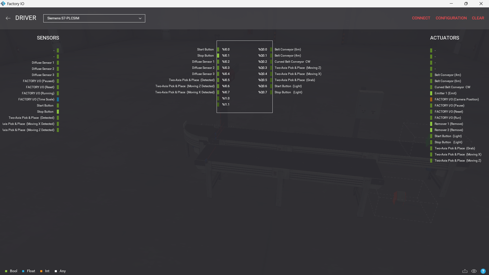
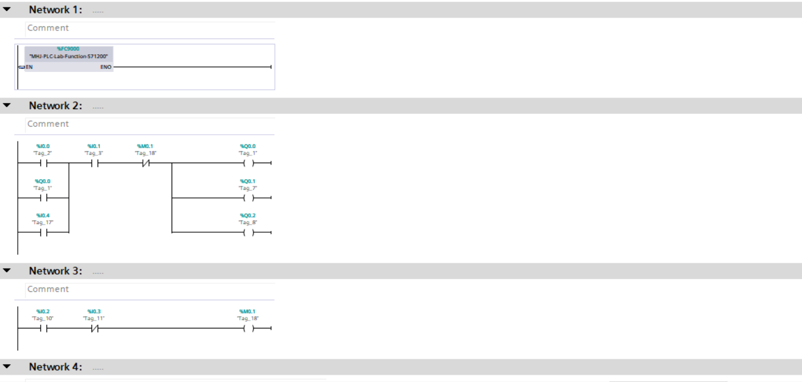
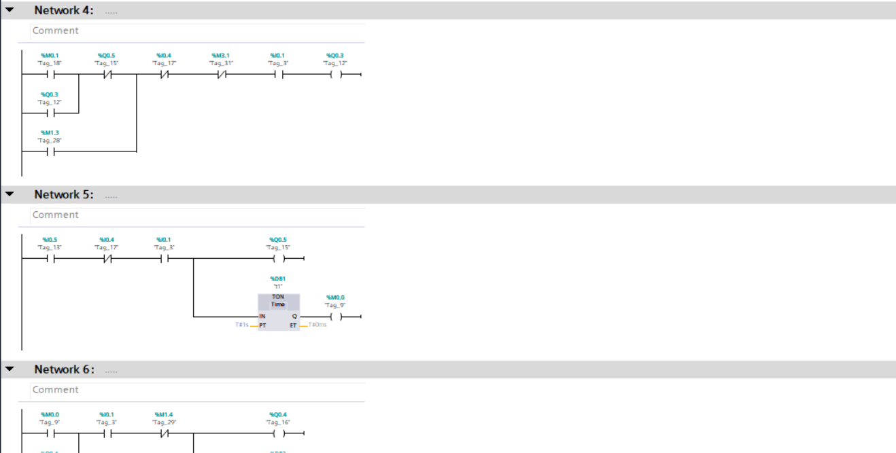
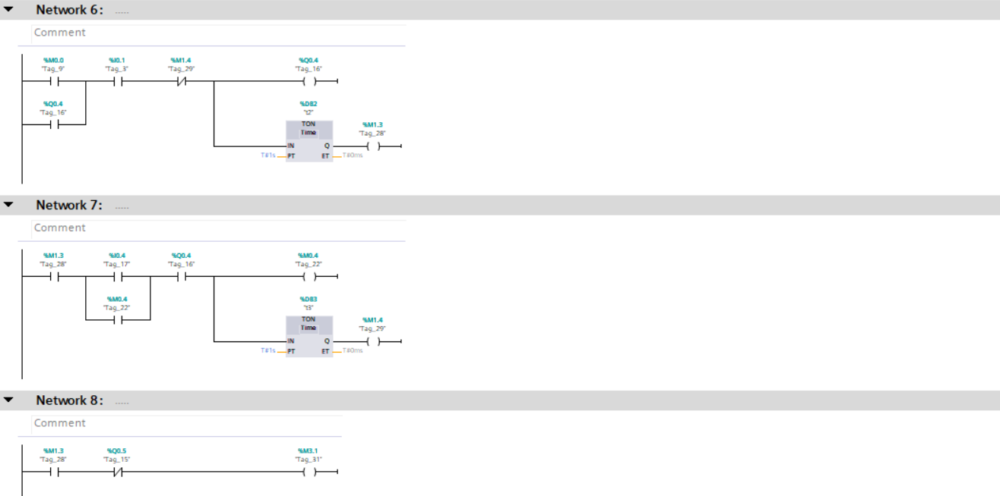
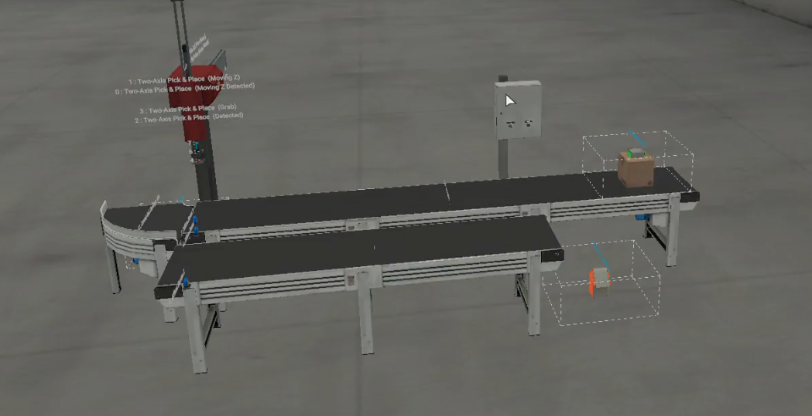

# PLC-Two-Axis-Pick-and-Place-System

## 📌 Project Overview
This project demonstrates an advanced automated material handling system using a **Two-Axis Pick & Place robot** integrated with conveyor systems.

The system detects incoming parts, precisely positions the robotic axes, picks items using a vacuum gripper, and transfers them to a target location — all controlled using **Siemens PLC** and simulated in **Factory I/O**.

---

## 🛠️ Technologies Used
- **PLC Programming:** Siemens TIA Portal (S7-1200)  
- **Simulation:** Factory I/O  
- **PLC Simulation:** Siemens S7-PLCSIM  
- **Programming Language:** Ladder Diagram (LAD)  

---

## 🤖 System Operation Sequence
The system is designed using structured **sequential control logic**:

1. **Part Detection**
   - Diffuse sensors detect part arrival on the conveyor  

2. **Robot Positioning**
   - X and Z axes move based on feedback signals  
   - Position confirmed using "Moving Detected" signals  

3. **Gripping Process**
   - Vacuum gripper activated (%Q0.5)  
   - Triggered when part presence is confirmed (%I0.5)  

4. **Transfer Motion**
   - Robot lifts and moves the part using timed sequences  
   - Controlled using **TON timers** for smooth operation  

5. **Release & Return**
   - Part released at destination  
   - Robot returns to home position for next cycle  

---

## 🧠 Control Logic Highlights

- **Sequential State Control**
  - Implemented using memory bits (M-tags)  
  - Each stage of motion is clearly defined and tracked  

- **Timer-Based Synchronization**
  - TON timers ensure proper gripping and release timing  

- **Motion Coordination**
  - Synchronization between X-axis and Z-axis movement  

- **Safety Interlocking**
  - Conveyors stop during pick operation  
  - Prevents collisions and ensures safe handling  

---

## 📸 Project Preview

### 🔹 Driver Configuration

### 🔹 Control Logic (LAD)
  
  

### 🔹 Factory I/O Scene

---

## 🎥 Demo Video
👉 [Watch the system in action](video.mp4)

---

## 📂 Project Files Included
- TIA Portal Project File  
- Factory I/O Scene File  
- PLC Logic Screenshots  
- Full Simulation Video  

---

## 🚀 How to Run the Project
1. Open the project in **TIA Portal**  
2. Start **S7-PLCSIM** and download the program  
3. Open the scene in **Factory I/O**  
4. Connect using `S7-PLCSIM Driver` (ensure connection is active)  
5. Switch to RUN mode  
6. Press **Start** to begin automatic operation  

